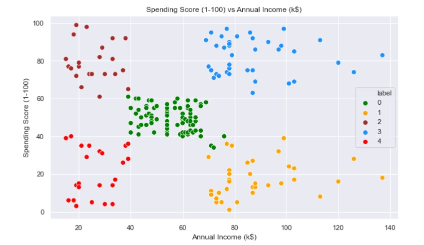

# Análisis de Clientes del Centro Comercial



Este repositorio contiene varios algoritmos para analizar un dataset de clientes de un centro comercial. Los análisis incluyen la compresión y preparación de datos, minería predictiva, estadísticas descriptivas, clustering utilizando K-Means, agrupación jerárquica y árboles de decisión en Machine Learning. Los scripts están en formato Jupyter Notebook (.ipynb).

## Requisitos

- Python 3.x
- Pandas
- Matplotlib
- Seaborn
- Scikit-learn
- SQLite
- Jupyter Notebook
- Google Colab

## Instrucciones de Uso

1. Clona este repositorio: 
    ```bash
   git clone https://github.com/JaviBrenes/DataMing_Project.git
    ```
2. Navega al directorio del proyecto:
    ```bash
    cd DataMing_Project
    ```
3. Abre los Jupyter Notebooks para ejecutar los análisis:
    ```bash
    jupyter notebook
    ```

## Contribuciones

Las contribuciones son bienvenidas. Por favor, abre un issue o envía un pull request para discutir cualquier cambio importante antes de realizarlo.

## Licencia

Este proyecto está licenciado bajo la Licencia MIT.

---

### Autor

Francisco Javier Brenes


## Contenido

1. [Compresión de los Datos](Compresión%20de%20los%20Datos.ipynb)
2. [Preparación de Datos](Preparación%20de%20Datos.ipynb)
3. [Minería Predictiva](Minería%20Predictiva.ipynb)
4. [Estadística Descriptiva](Estadística%20Descriptiva.ipynb)
5. [K-Means en Machine Learning](K-Means%20en%20Machine%20Learning.ipynb)
6. [Agrupación de Jerarquía en Machine Learning](Agrupación%20de%20Jerarquia%20en%20Machine%20Learning.ipynb)
7. [Árbol de Decisión en Machine Learning](Arbol%20decision%20Machine%20Learning.ipynb)

### Descripción del Dataset

El dataset utilizado en este proyecto se titula **Mall Customer**. Este conjunto de datos proporciona información sobre clientes de un centro comercial, incluyendo características demográficas y variables relacionadas con el comportamiento de compra. A continuación se detallan las columnas principales del dataset:

- **Gender**: Género del cliente (Male/Female).
- **Age**: Edad del cliente.
- **Annual Income (k$)**: Ingreso anual del cliente en miles de dólares.
- **Spending Score (1-100)**: Puntuación asignada por el centro comercial basada en el comportamiento del cliente y el gasto.

El objetivo del análisis realizado con este dataset es identificar patrones en el comportamiento de gasto de los clientes mediante técnicas de agrupación jerárquica y árboles de decisión, así como analizar la distribución demográfica y su impacto en el comportamiento de compra.

Fuente de datos: [Mall_Customer.xlsx](https://github.com/JaviBrenes/DataMing_Project/blob/main/Dataset/Mall_Customer.xlsx)


## Algoritmos

### Compresión de los Datos


1. **Recolección de Datos**: Carga de datos desde un archivo Excel.
2. **Descripción de los Datos**: Descripción estadística básica y visualización.
3. **Exploración de Datos**: Visualizaciones como histogramas y gráficos circulares.

### Preparación de Datos


1. **Cargar la Información**: Importar datos desde un archivo Excel.
2. **Limpieza de los Datos**: Verificación de valores nulos y eliminación de duplicados.
3. **Almacenamiento en Base de Datos**: Almacenamiento de datos en una base de datos SQLite.

### Minería Predictiva


1. **Cargar los Datos**: Conexión a la base de datos SQLite([Mall_Customer.db](https://github.com/JaviBrenes/DataMing_Project/blob/main/Dataset/Mall_Customer.db)).
2. **Agrupación y Predicción**: Agrupación por categorías de edad y predicción de ingresos anuales para 2025.
3. **Predicción de Puntuación de Gasto**: Análisis de la puntuación de gasto actual y predicha por género.

### Estadística Descriptiva


1. **Cargar Datos**: Conexión a la base de datos SQLite([Mall_Customer.db](https://github.com/JaviBrenes/DataMing_Project/blob/main/Dataset/Mall_Customer.db)).
2. **Análisis por Grupo de Edad**: Análisis estadístico descriptivo para diferentes grupos de edad (Jóvenes, Adultos, Adultos Mayores).

### K-Means en Machine Learning


1. **Cargar Datos**: Importar datos desde un archivo Excel.
2. **Análisis de Datos**: Exploración y visualización de los datos.
3. **Clustering K-Means**: Aplicación del algoritmo K-Means y análisis de los clusters.
4. **Visualización**: Visualización de los resultados de clustering.

### Agrupación de Jerarquía en Machine Learning


1. **Cargar Datos**: Se cargan los datos desde un archivo Excel y se preprocesan utilizando StandardScaler y SimpleImputer para manejar valores nulos y escalar los datos.
2. **Identificación de Patrones de Gasto**: Se convierte el género a valores numéricos, se manejan los valores faltantes, se escalan los datos y se aplica la agrupación jerárquica. Se grafica un dendrograma para identificar patrones de gasto.
3. **Análisis de Distribución Demográfica**: Se aplica la agrupación jerárquica usando solo las características demográficas y se grafica un dendrograma para analizar la distribución demográfica y cómo afecta el comportamiento de gasto.

### Árbol de Decisión en Machine Learning


1. **Cargar Datos**: Se cargan los datos desde un archivo Excel y se preprocesan utilizando StandardScaler y SimpleImputer para manejar valores nulos y escalar los datos.
2. **Identificación de Patrones de Gasto**: Se convierte el género a valores numéricos, se manejan los valores faltantes, se escalan los datos y se entrena un modelo de árbol de decisión con una profundidad máxima limitada. Se grafica el árbol de decisión para identificar patrones de gasto.
3. **Análisis de Distribución Demográfica**: Se preparan las características demográficas y la variable objetivo de comportamiento de gasto, se dividen los datos en conjuntos de entrenamiento y prueba, y se entrena un modelo de árbol de decisión con una profundidad máxima limitada. Se grafica el árbol de decisión para analizar la distribución demográfica y cómo afecta el comportamiento de gasto.
